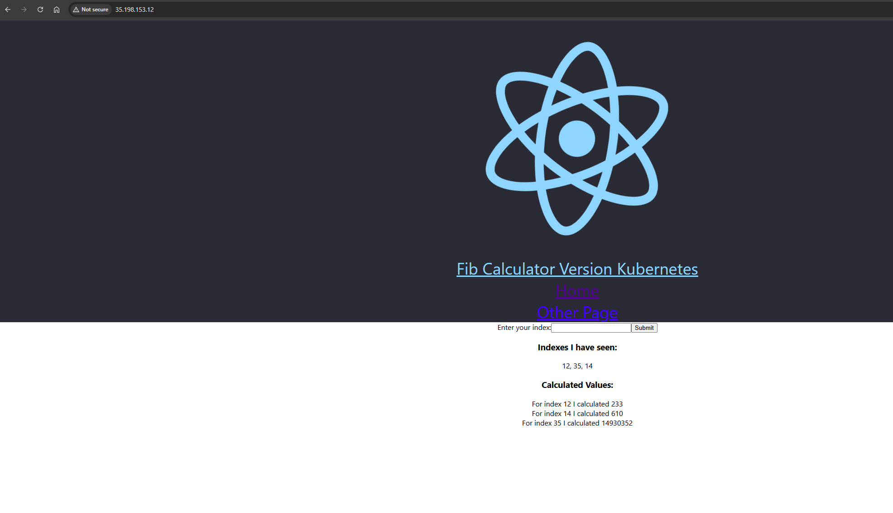
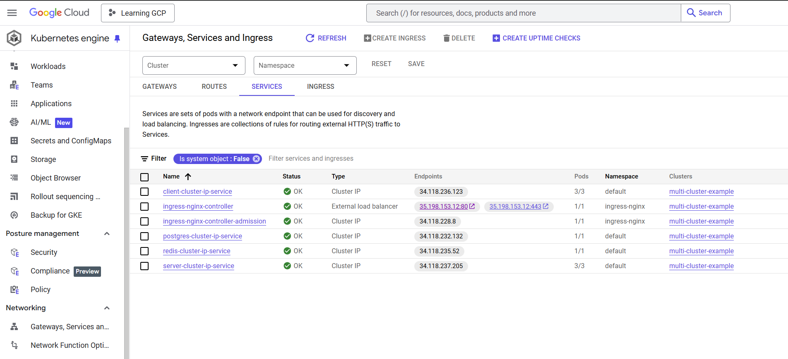

# Kubernetes GCP Project
 In this project, I deployed a multi worker app to the Google Cloud Platform using Kubernetes. The app have a redis, postgres, react App for displaying and storing input data. The app is deployed using Kubernetes and the deployment is managed by Helm. The app is deployed in a cluster with 3 nodes. The app is accessible via a load balancer. The app is also deployed using CI/CD pipeline - GitHub Actions.

## Running the app

To run the app:

1. Create a Service Account on Google. Download the JSON file and add it to GitHub Secrets as `GKE_SA_KEY`.
2. Add `DOCKER_USERNAME` and `DOCKER_PASSWORD` to GitHub Secrets.
3. Update the GitHub Actions workflow file with your project_id / location / cluster_name.
4. In the cluster, create a secret for the Postgres password:

```bash
kubectl create secret generic pgpassword --from-literal PGPASSWORD=your_password
```

5. Install the helm using this command:

```bash
curl -fsSL -o get_helm.sh https://raw.githubusercontent.com/helm/helm/main/scripts/get-helm-3
chmod 700 get_helm.sh
./get_helm.sh
```

6. Install the ingress service:

```bash
 helm upgrade --install ingress-nginx ingress-nginx   --repo https://kubernetes.github.io/ingress-nginx   --namespace ingress-nginx --create-namespace
```

7. Run the GitHub Actions workflow or just push the changes to main branch.
8. If the GitHub Actions workflow is successful, the app is deployed. You can access docker hub to see the images.
9. To access the app, get the external IP of the load balancer. This is available in Networking, Under "Services" in the ingress-nginx-controller endpoints.

```bash
kubectl get services
```

10. Access the app using the external IP.
11. Delete the cluster and resources after use. 

## Output




